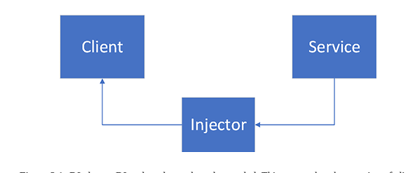

# <p align="center">Dependency Injection</p>



- A service is a class that can be used (this is the dependency).
- The client is a class that uses the dependency.
- The injector passes the dependency (the service) to the dependent
class (the client)

# Question

1. **What is dependency injection**
    - DI is a programming concept that enables a connection between
    component without becoming overly dependent on each other.
   
2. **How does the @Autowired annotation work in Spring Boot?**
   - It tells Spring Boot which constructor is used for DI. 

3. **How do you inject resources in Spring Boot?**
    - Constructor Injection: ```Dependencies are injected through a constructor```
    - Setter Injection: ```Dependencies are injected through setter methods```
    - Field Injection: ```Dependencies are injected directly into fields```